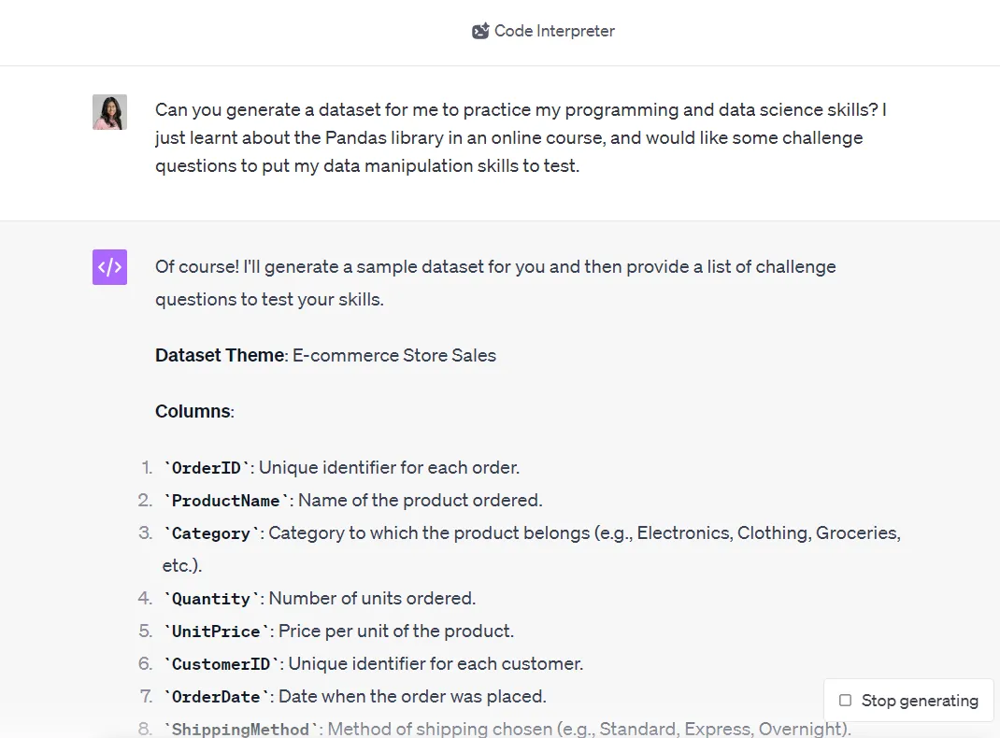

# Prompts

## Project Based Prompts

 1. What are the ways to analyze this dataset to import the e-commerce company's sales ?
 2. how we can we perform customer segmentation on this dataset? What are the steps that need to be taken
 3.  What are the ways to decide the number of clusters (K) in K-Means clustering ?
 4.  Can we visualize the clusters that were created? 
     Let's create a separate chart for each cluster. 
     Each chart should showcase the cluster's mean R, F, and M scores.
 5. Based on their RFM scores alone, can you come up with some 
    personalized targeting recommendations on the best way to 
    reach each customer segment?

## Getting Deep Insight Of Machine Learing Models

 1.  What are the ways to decide the number of clusters (K) in K-Means clustering ?

## Practice Related

 1. I've just completed an entry-level programming course and want to put my 
    Python coding skills to practice. 
    Can you give me some programming challenge questions at a 
    beginner-intermediate level?
2.  Can you explain the requirements of the "FizzBuzz" question? 
    And provide me with a sample input and output.

===== After Solving Yourself =======

3.  Here's my code to solve FizzBuzz. 
    Is this accurate, and if not, can you guide me in getting the correct answer?

    
